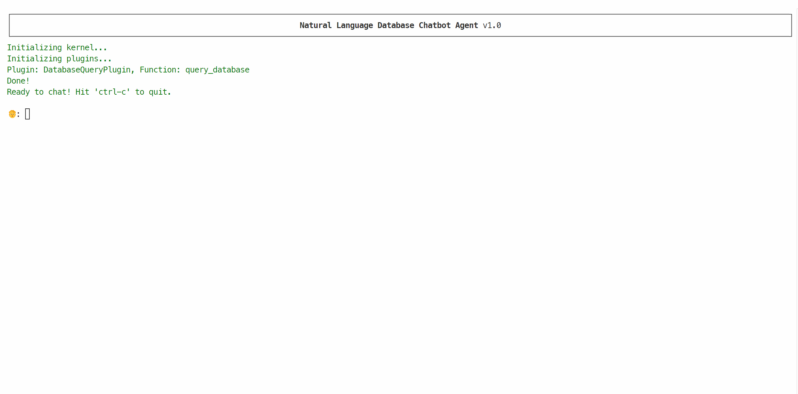

# Azure SQL Natural Language to SQL Queries

This repository is the accompanying code for the "[A story of collaborating agents: chatting with your database the right way](https://devblogs.microsoft.com/azure-sql/a-story-of-collaborating-agents-chatting-with-your-database-the-right-way/)" article. Make sure that check that out.



## Prerequisites

- [Azure OpenAI chat model](https://learn.microsoft.com/en-us/azure/ai-services/openai/overview#get-started-with-azure-openai) (sample was tested with GTP-4o model)
- [Docker](https://www.docker.com/)
- [VS Code](https://code.visualstudio.com/) with [MSSQL extension](https://marketplace.visualstudio.com/items?itemName=ms-mssql.mssql)
- [go-sqlcmd](https://learn.microsoft.com/en-us/sql/tools/sqlcmd/sqlcmd-utility?view=sql-server-ver17&tabs=go%2Cwindows%2Cwindows-support&pivots=cs1-bash#download-and-install-sqlcmd)

## Run SQL Server instance with AdventureWorks database

Once you have Docker and sqlcmd installed, running a SQL Server instance with the needed sample database is as easy as running the following command:

```bash
sqlcmd create mssql --accept-eula --tag 2025-latest --using https://github.com/Microsoft/sql-server-samples/releases/download/adventureworks/AdventureWorks2022.bak
```

The command will 
- download the SQL Server image and 
- run it in a container
- secure the installation by creating an admin user with a strong password
- restore the sample AdventureWorks2022 database

The image is free to use and it is using the Developer Edition of SQL Server. 

## Get the connection string

Once the container is running, get the connection string for ADO.NET

```bash
sqlcmd config connection-strings
```

make sure to copy and paste the connection string *without* the ADO.NET prefix. The connection string looks like the following:

```text
Server=tcp:127.0.0.1,1433;Initial Catalog=AdventureWorks2022;Persist Security Info=False;User ID=<user>;Password=<password>;MultipleActiveResultSets=False;Encrypt=True;TrustServerCertificate=True;Connection Timeout=30;
```

## Create .env file

Create the `.env` file fromt the provided `.env.sample` file. For the sample to run you need to specify the Azure OpenAI endpoint and model deployment name. You also need to specify API KEY, if you are not using EntraID. If you are using [Entra ID to access Azure OpenAI](https://learn.microsoft.com/en-us/azure/ai-services/openai/how-to/role-based-access-control#cognitive-services-openai-user), simple remove the `OPENAI_KEY` line from the file: the `DefaultAzureCredential` [class](https://learn.microsoft.com/en-us/dotnet/api/azure.identity.defaultazurecredential?view=azure-dotnet) will be used to provide your EntraID credentials to Azure OpenAI service.

```bash
OPENAI_URL="https://.openai.azure.com/"
OPENAI_KEY=""
OPENAI_CHAT_DEPLOYMENT_NAME="gpt-4o"
```

In the `.env` file you also have to specify the connection string, copying it from the value you got before:

```bash
MSSQL_CONNECTION_STRING="Server=tcp:127.0.0.1,1433;Initial Catalog=AdventureWorks2022;Persist Security Info=False;User ID=<user>;Password=<password>;MultipleActiveResultSets=False;Encrypt=True;TrustServerCertificate=True;Connection Timeout=30;"
```

## Run the application

Once the `.env` file is set, you can run the application just by using the following command:

```bash
dotnet run chat
```

and you'll be good to go. If you want to peek behind the scenes and see what's going on between AI Agents and how they collaborate to answer your questions, run it in debug mode:

```bash
dotnet run chat --debug
```

You can use the sample prompt provided in the `prompts.txt` file or, even better, just ask *any* question as see how the Agents handle that.
